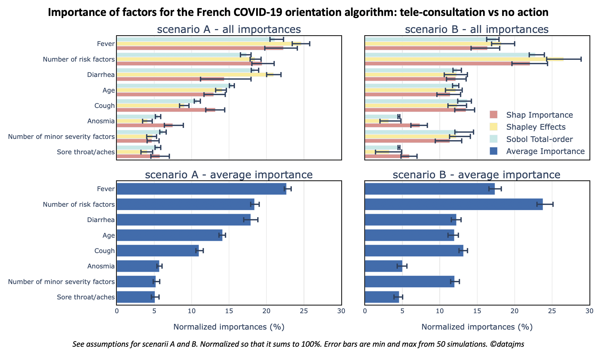

## Variable importance experiments on the Covid-19 patient orientation algorithm

Python experiments on **global sensitivity and variable importances methods** (Sobol Indices, Shapley Effects and shap) on the **French Covid-19 patient orientation** algorithm.

Blog article for context and discussion: [Breaking down factors of Covid-19 orientation algorithm by importance](https://datajms.com/post/covid_variable_importances_shapley/).


### Quick start

Once installed, activate the python environment

```bash
. activate
```

Then, you can re-run each experiment (independent scripts).
Each script writes into data_n_figures/all_experiments_results.csv on the fly.
You can run several process in parallel, it will not mess up the writing of
the file.

```bash
cd experiments/
python my_logger.py # Delete csv data and set-up logger
python run_sobol.py # Run Sobol ~ 20min
python run_shapley_effects.py # Run Shapley Effects ~ 24h
python run_kernelshap.py # Run shap ~24h
```

You can rebuild figures from the csv data:

```bash
python build_figures.py
```
Here are the results! Details in the [blog post](https://datajms.com/post/covid_variable_importances_shapley/).



### Installation

Instructions to re-run experiments for python ≥3.6

**Initial set-up** (only once): It creates a python3.6 environment and install requirements with pip.

```bash
. init
```

### Resources
**Python packages**:

- [SALib](https://github.com/SALib/SALib): Herman, J., & Usher, W. (2017). SALib: an open-source Python library for sensitivity analysis. Journal of Open Source Software, 2(9), 97.
- [shapley-effects](https://gitlab.com/CEMRACS17/shapley-effects): Benoumechiara, N., & Elie-Dit-Cosaque, K. (2017), developed at the CEMRACS 2017 with the help of Iooss, B., Sueur, R., Maume-Deschamps, V., & Prieur, C.
- [shap](https://github.com/slundberg/shap):
Lundberg, S. M., & Lee, S. I. (2017). A unified approach to interpreting model predictions. In Advances in neural information processing systems (pp. 4765-4774).

**Sensitivity Analysis and shap Bibliography**:

- Iooss, B., & Lemaître, P. (2015). [A review on global sensitivity analysis methods](https://core.ac.uk/download/pdf/50535254.pdf). In Uncertainty management in simulation-optimization of complex systems (pp. 101-122). Springer, Boston, MA.
- Sobol, I. M. (1993). [Sensitivity estimates for nonlinear mathematical models](http://www.andreasaltelli.eu/file/repository/sobol1993.pdf). Mathematical modelling and computational experiments, 1(4), 407-414.
- Song, E., Nelson, B. L., & Staum, J. (2016). [Shapley effects for global sensitivity analysis: Theory and computation](https://pdfs.semanticscholar.org/6a25/48b159bc3bf6c74e13b74a037917951d75ca.pdf). SIAM/ASA Journal on Uncertainty Quantification, 4(1), 1060-1083.
S
- Benoumechiara, N., & Elie-Dit-Cosaque, K. (2019). [Shapley effects for sensitivity analysis with dependent inputs: bootstrap and kriging-based algorithms](https://www.esaim-proc.org/articles/proc/pdf/2019/01/proc196511.pdf). ESAIM: Proceedings and Surveys, 65, 266-293.
- Lundberg, S. M., & Lee, S. I. (2017). [A unified approach to interpreting model predictions](http://papers.nips.cc/paper/7062-a-unified-approach-to-interpreting-model-predictions.pdf). In Advances in neural information processing systems (pp. 4765-4774).
